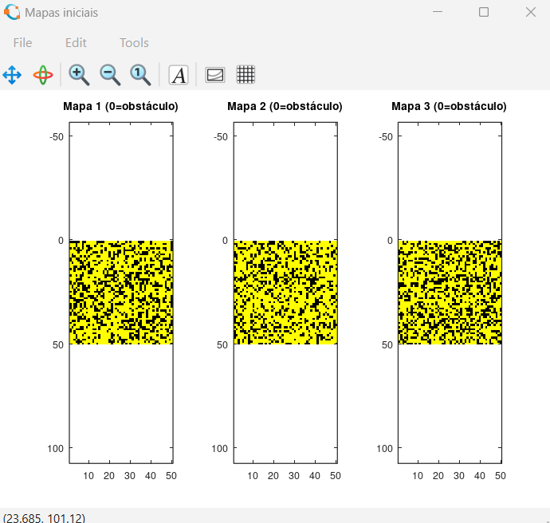
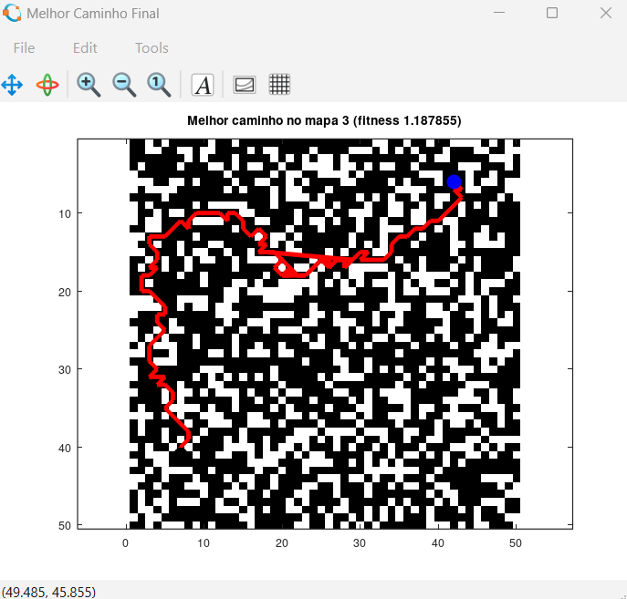

  <strong>
    <a href="./README.md">English</a>
    &nbsp;|&nbsp;
    Português
  </strong>

# Algoritmo Híbrido ACO-GA para Planejamento de Caminhos Multimapa

Este repositório contém a implementação completa de uma abordagem **híbrida de Otimização por Colônia de Formigas (ACO)** e **Algoritmo Genético (GA)** para **planejamento de trajetórias de robôs autônomos de resgate** em ambientes incertos, considerando **múltiplos mapas possíveis**.

O projeto é inspirado em um artigo científico recente e inclui uma **modificação técnica própria**, desenvolvida para melhorar a velocidade de convergência e a qualidade das soluções encontradas.

---

## 📚 Artigo Base

Esta implementação é baseada no seguinte artigo científico:

**Zhang, J., Xu, Z., Liu, H., Zhu, X., & Lan, B. (2025)**  
*An Improved Hybrid Ant Colony Optimization and Genetic Algorithm for Multi-Map Path Planning of Rescuing Robots in Mine Disaster Scenario*  
**Machines (MDPI), Volume 13, Edição 6**

🔗 **Link do artigo:**  
https://www.mdpi.com/2075-1702/13/6/474  
🔗 **DOI:** https://doi.org/10.3390/machines13060474

---

## 🧠 Visão Geral do Problema

Em cenários de desastres em minas, robôs precisam operar em ambientes com:
- Alta incerteza
- Mapas incompletos ou desatualizados
- Obstáculos dinâmicos e imprevisíveis

O planejamento de caminhos baseado em **um único mapa determinístico** frequentemente falha quando aplicado ao ambiente real.  
Para lidar com esse problema, a solução proposta avalia os caminhos considerando **múltiplos mapas possíveis**, onde cada mapa representa um cenário plausível do ambiente.

---

## 🧩 Visão Geral da Solução

O algoritmo combina duas técnicas bioinspiradas:

### 🐜 Otimização por Colônia de Formigas (ACO)
- Exploração global do espaço de busca
- Geração de caminhos iniciais viáveis e diversos
- Alta robustez em ambientes complexos

### 🧬 Algoritmo Genético (GA)
- Otimização local e refinamento das soluções
- Seleção, crossover e mutação baseados em aptidão
- Otimização considerando múltiplos mapas simultaneamente

A fase ACO gera soluções iniciais de alta qualidade, que são posteriormente refinadas pela fase GA.

  

  <em>Exemplo de múltiplos mapas de grade gerados para simular diferentes cenários possíveis do ambiente.</em>

---

## ⚙️ Ambiente de Implementação

- **Linguagem:** GNU Octave (.m)
- **Paradigma:** Modular e funcional
- **Modelo de mapa:** Grade bidimensional (2D)

---

## 🗂️ Estrutura do Projeto

### `run_hybrid.m`
Script principal de execução.

Responsabilidades:
- Definir parâmetros do ACO e do GA
- Gerar mapas de teste
- Selecionar o mapa de referência
- Executar as fases ACO e GA
- Plotar o caminho final
- Exportar resultados (`.mat`)

---

### `generate_example_maps.m`
Gera múltiplos mapas de grade 50×50 com diferentes densidades de obstáculos.

Codificação das células:
- `0` → Obstáculo  
- `1` → Área livre  
- `2` → Ponto inicial  
- `3` → Ponto final  

Simula diferentes cenários possíveis de desastre.

---

### `select_reference_map.m`
Seleciona o mapa mais complexo (maior quantidade de obstáculos) como mapa de referência, aumentando a robustez do planejamento da trajetória.

---

### `find_map_start_goal.m`
Localiza automaticamente os pontos de início e destino no mapa e valida sua consistência.

---

### `get_free_neighbors.m`
Retorna as células vizinhas válidas (movimento em 8 direções), respeitando:
- Limites do mapa
- Evitamento de obstáculos

Utilizado tanto no ACO quanto no GA.

---

## 🐜 Fase de Otimização por Colônia de Formigas (ACO)

### `ACO_generate_paths.m`
Responsável por gerar a população inicial de caminhos utilizando uma estratégia aprimorada de ACO.

Principais características:
- Inicialização do feromônio baseada na distância euclidiana até o objetivo
- Construção probabilística de caminhos por seleção em roleta
- Atualização global do feromônio com penalização de risco
- Descarte de caminhos sem saída
- Garantia de uma população mínima viável

Funções auxiliares:
- `aco_single_walk`
- `roulette_select`
- `path_total_length`
- `compute_sigma`

---

## 🧬 Fase do Algoritmo Genético (GA)

### `GA_optimize.m`
Refina os caminhos gerados pela fase ACO.

Inclui:
- Avaliação de aptidão considerando múltiplos mapas
- Seleção por roleta
- Operações de crossover
- Mutação guiada por feromônio
- Registro da melhor solução global

Funções auxiliares:
- `evaluate_multimap`
- `path_smoothness`
- `path_crossover`
- `path_mutation`

---

## 🚧 Estratégia de Desvio de Obstáculos

### `Avoid_rectangular.m`
Implementa uma estratégia de desvio de obstáculos baseada em regiões retangulares.

Fluxo:
1. Detecta segmentos do caminho que cruzam obstáculos
2. Expande uma região retangular ao redor do obstáculo
3. Aplica BFS para encontrar um caminho alternativo
4. Substitui o segmento inválido
5. Repete até obter um caminho viável

Essa abordagem reduz significativamente o custo computacional em comparação ao replanejamento completo.

---

## 🎨 Visualização

### `draw_map_with_path.m`
Responsável pela visualização do mapa e do caminho final.

Esquema de cores:
- Preto → Espaço livre
- Branco → Obstáculos
- Azul → Início
- Vermelho → Caminho final

Facilita a validação visual dos resultados.

  

  <em>
    Caminho final otimizado gerado pelo algoritmo híbrido ACO-GA,
    considerando múltiplos mapas e incertezas do ambiente.
  </em>

---

## 🔬 Modificação Técnica (Contribuição Própria)

### Heurística Adaptativa de Feromônio

Uma modificação técnica própria foi implementada no arquivo: `ACO_generate_paths.m`.

#### Descrição
Em vez de utilizar valores fixos para a influência do feromônio (α) e da heurística de distância (β), esses parâmetros são **ajustados dinamicamente ao longo das iterações** do algoritmo.

Para controlar o equilíbrio entre **exploração** e **intensificação** durante as iterações do ACO, os pesos do feromônio e da heurística de distância são atualizados dinamicamente de acordo com a iteração atual.

$$
\alpha_t = \alpha + \frac{t}{T_{\max}} \times 1.5
$$

$$
\beta_t = \max \left( 1,\; \beta - \frac{t}{T_{\max}} \times 2.0 \right)
$$

onde:
- $t$ representa a iteração atual do ACO  
- $T_{\max}$ é o número máximo de iterações do ACO  
- $\alpha_t$ é a influência do feromônio na iteração $t$  
- $\beta_t$ é a influência da heurística de distância na iteração $t$  

#### Estratégia
- Iterações iniciais:
  - Maior peso da heurística de distância
  - Maior exploração do espaço de busca
- Iterações finais:
  - Maior peso do feromônio
  - Intensificação dos melhores caminhos encontrados

#### Efeitos observados
- Convergência mais rápida
- Caminhos mais estáveis e consistentes
- Redução do número de iterações
- Melhora no tempo total de execução

Essa modificação **não está descrita explicitamente no artigo original** e foi adicionada como uma melhoria experimental.

---

## 🔢 Parâmetros Utilizados

- Tamanho da população: 80
- Número de formigas: 80
- Iterações do ACO: 90
- Iterações do GA: 60
- Probabilidade de crossover: 0.2
- Probabilidade de mutação: 0.05
- Parâmetros do ACO:
  - α = 2
  - β = 8
  - ρ = 0.25

---

## 📈 Resultados

O algoritmo híbrido ACO-GA com heurística adaptativa demonstrou:
- Maior robustez em ambientes incertos
- Melhor suavidade e viabilidade dos caminhos
- Menor custo computacional em comparação com métodos isolados
